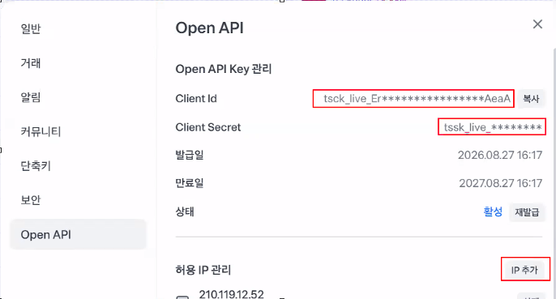

# ai-vibecoding-2026

바이브코딩 리포지토리

## Chapter 1

AI에게 코딩을 시키자, 제대로!

### 개념

코딩을 직접하ㄴ지는 말 것. AI와 협업해서 새로운 프로그램을 만들자

#### 기존 개발 방법

요구사항 분석 -> 설계(DB/UI 포함) -> 구현/디버깅 -> 테스트 -> 배포 -> 유지보수

#### 바이브코딩 방식

요구사항정의(PRD) -> AI 가 코드 생성/디버깅 -> 사람이 **검증**, 수정 요청, 직접 수정 -> 배포(AI) -> 유지보수(AI)

#### 핵심 포인트

- AI - 주니어/시니어 개발
- 사람 - PM + 리뷰어

### 바이브코딩 개발환경

- VS Code, VS Code Insider, Android Studio(모바일 앱 개발), ...

#### VS Code

- 채팅창 - 안씀
- 확장 패키지 - Codex, Claud Code for VS Code, Gemini Code Assist

#### Codex

- 설치 후 확장 아이콘 아래, Codex 아래 아이콘 확장

#### CLI Codex

- 파워쉘, 콘솔 창에서 명령어로 수행하는 Codex

#### 바이브 코딩

- 제로샷 프롬프트 : 아무런 기초지식없이 대화로 바이브코딩
- 원샷 프롬프트 : 적어도 한줄의 요구사항을 작성해서 바이브코딩
- 퓨샷 프롬프트 : PRD 작성을 통한 바이브코딩


#### 프롬프트 사용법
- 이미지를 캡쳐해서 복사/붙여넣기 후 프롬프트 사용
- 특정 소스코드를 선택한 뒤 우클릭으로 `Add to Codex Thread` 선택 후 프롬프트 사용

### 자동매매 개발환경

토스증권 OpenAPI

- https:// corp.tossinvest.com/ko/open-api
- 토스앱 모바일 설치 가입
- 토스증권 사용 설정
- 토스증권 PC 웹사이트 동작
- 사용중인 아이피를 토스증권 PC 등록
- OpenAPI 키 발급 후 ClientID, CLient Secret 문자열 보관
- 주식 자동매매 시스템을 만들고 싶어. 근데 토스증권 API를 사용할 거야.
  https://developers.tossinvest.com/docs 이 주소에서 일단 문서 분석해줘

#### API 키 발급

- OpenAI 키 발급
- PC에서 투자하기 클릭
- 토스 앱 모바일로 인증
- 
- Client Id, Clien Secret 무조건 저장해놔야함.
- cmd > ipconfig로 보안 아이피 확인 후 추가

### 주식 자동매매 파이썬 프로그램 분석

- `__init__.py` - 일반적으로 파일만 생성. 소스코드 X, 프로젝트 폴더가 pip로 설치할 수 있는 패키지화
- `__main__.py` - 파이썬으로 실행될 때 가장 먼저 실행되는 메인 함수 파일
- `__pycache__` - 미리 만들어놓은 파이썬 실행 파일(캐쉬) ex.캐쉬파일. 처음엔 느린데 이후엔 빠름. 내 하드웨어에 캐시 저장.하고 이후 로드할 때 바뀐 파일만 로드하고 캐시 있는 건 다시 안 받음.
- tests - 소스코드 테스트 실행을 위한 폴더
- .env.example - 환경설정 예제파일 (.example 지우고 사용. 여기다 api 키값 입력을 해달라 요구)

  - .env 는 깃허브에 업로드 방지를 위해 .gitignore에 제외파일로 등록
- requirements.txt. - 파이썬 개발환경 패키지 설치리스트 파일

  - `pip install -r requirements.txt` 로 전부 설치


#### favicon ico 작업
- flaticon.com 에서 원하는 이미지 png 다운로드
- https://covertio.com 에서 png를 ico로 변환. 다운로드
- favicon.ico로 이름변경
- static 폴더에 복사
- index.html에 아래코드 추가
```html
<link rel="icon" href="/static/favicon.ico" type="image/x-icon">
```
- 
